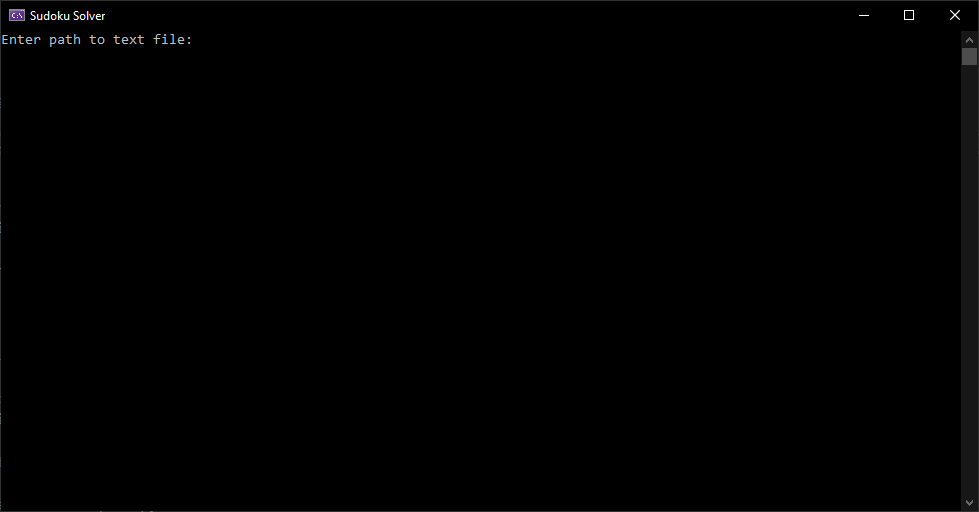
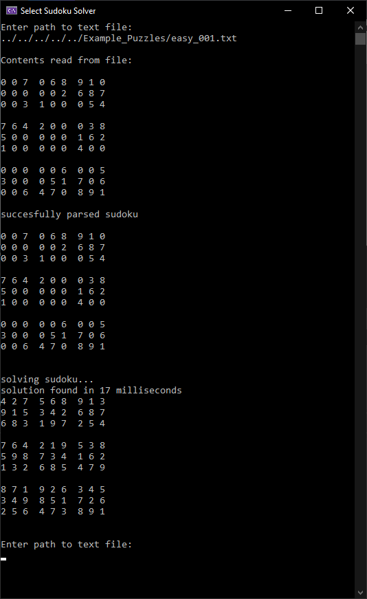
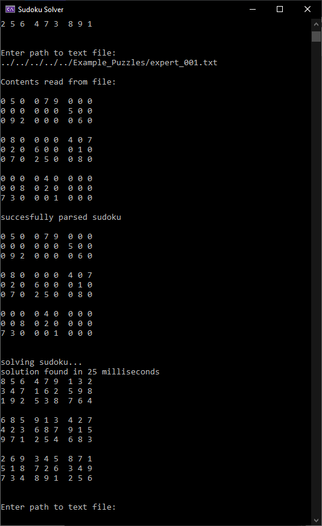

# Sudoku_Solver

C# console application

## how to use

- enter a filepath to a .txt file containing the sudoku you want to solve
- the .txt file should contain 9 rows with 9 nine numbers each; 1 through 9 or 0 for an empty cell

## sudoku solving algorithm

- values for empty cells are found by eliminating possible values,
- checking for missing values in rows, columns and blocks,
- using backtracking when empty cells remain

## example sudoku's

- Example_Puzzles folder contains valid example .txt files with sudoku's
- example sudoku's taken from www.sudoku.com
